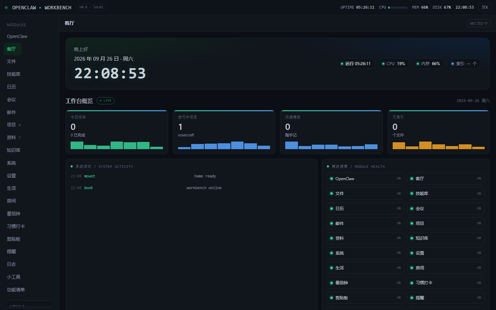
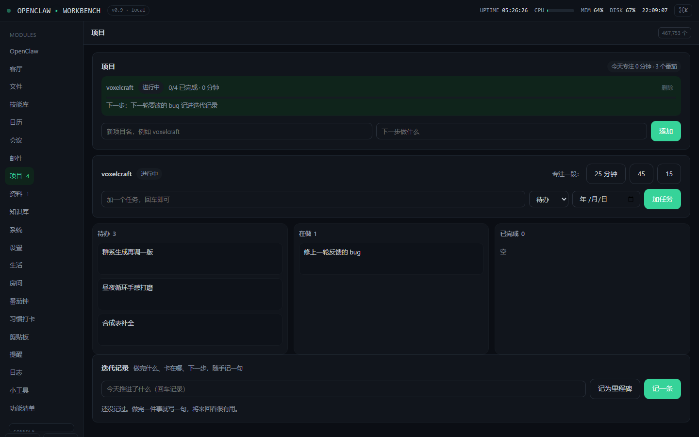
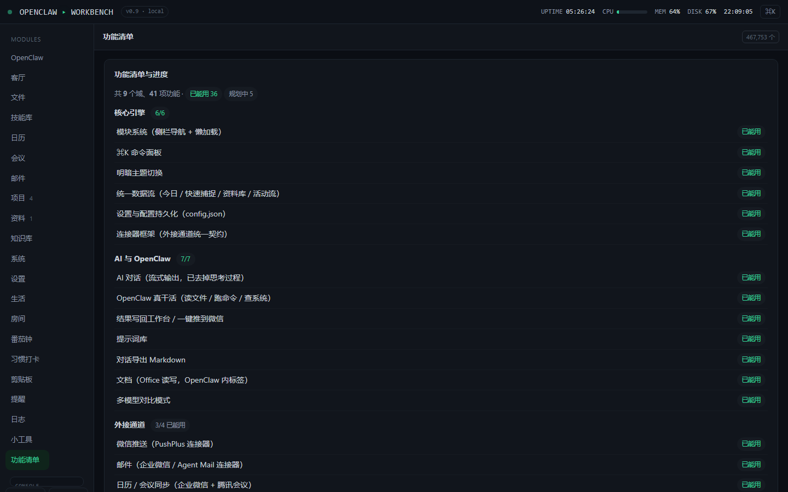
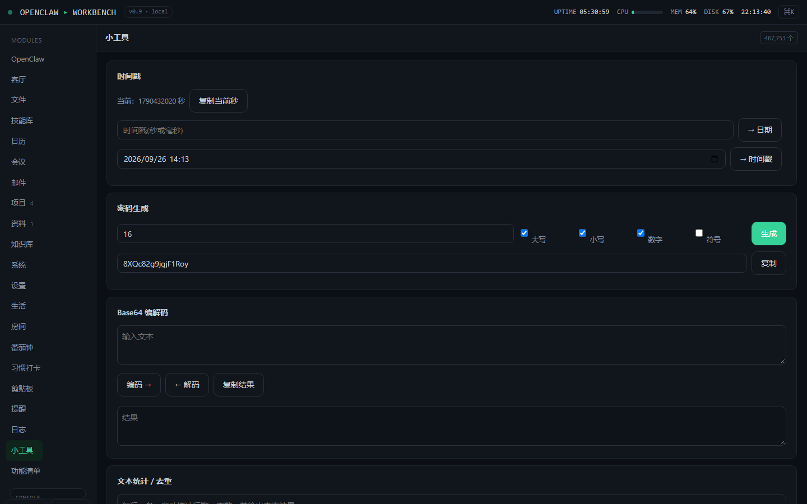

# OpenWorkbench

**一句话**：把你本机的 Ollama、OpenClaw、文件、终端、系统状态，接进一个**零第三方依赖**的本地工作台 —— 数据全程不出你的机器。

它不是另一个云面板。前端后端一体（`server.py` 既托管页面又处理 API），
只用 Python 标准库，`pip install` 什么都不用装。每个人跑自己的实例、
连自己本机的模型、各自做内网穿透 —— 这是「开源回环」的起点。

## 长什么样

| 客厅仪表盘 | 项目看板 |
| --- | --- |
|  |  |

| 功能全景（9 域 41 项） | 小工具 |
| --- | --- |
|  |  |

> 截图是干净的本地实例，不含任何个人信息。

---

## 一键装好环境（新用户先看这里）

开源项目最大的坎不是代码，是"clone 下来还要手填配置才能跑"。所以给了两个脚本：
**装 Ollama、装 OpenClaw、拉模型、并把 `config.json` 自动指向你本机的 Ollama**。

| 系统 | 命令（在项目目录下执行） |
| --- | --- |
| Windows | `powershell -ExecutionPolicy Bypass -File install.ps1` |
| macOS / Linux | `sudo ./install.sh` |

想全自动、不再逐步确认：`install.ps1 -Yes` / `sudo ./install.sh --yes`

### macOS / Linux：怎么跑（需要 root / sudo）

```bash
sudo ./install.sh               # 推荐：整体以 root 跑，脚本内部会把 brew/ollama 降回你本人
chmod +x install.sh && sudo ./install.sh   # 想用 ./ 这种写法就先赋一次执行权
```

> 从 Git clone 下来的 `install.sh` 已经带执行位，理论上 `sudo ./install.sh` 就能跑；
> 如果报 `Permission denied`，补一次 `chmod +x install.sh` 即可。
>
> **不是 root 也能跑**：脚本检测到当前不是 root 会自动 `sudo` 重新以 root 运行自己（保留你传的 `--yes` 等参数）；
> 你也可以在跑之前自己先 `sudo`。

**为什么是整个脚本 sudo、而不是只在某几步 sudo：** mac 上装 Ollama / Node / OpenClaw 几乎每步都要权限，
整体 sudo 一次最省事。但 `brew` 与 `ollama` 必须降回你本人执行：

- **brew 直接拒绝以 root 运行**（`Running Homebrew as root is extremely dangerous`），所以脚本用 `sudo -u <你> brew …` 代你跑；
- **ollama 的模型要落在你自己的家目录**，以 root 跑 `ollama pull` 会下进 `/root/.ollama`，你日常跑的 ollama 反而看不到、也写不进。

脚本的正确姿势是：**以 root 运行整个脚本，brew / ollama / openclaw / npm 全部以你的身份执行；只有 `apt`、官方 Ollama 安装脚本写 `/usr/local`、以及收尾 chown 才用 root**，
而且默认会先把每条命令打出来等你按回车。没装 `sudo` 时脚本会要求你以 root 重跑。

### mac 上默认走 Homebrew（脚本内部以你的身份跑）

检测到装了 Homebrew 时，脚本会这样装 —— 它用 `sudo -u <你>` 代你执行，brew 的目录（`Apple Silicon` 上是 `/opt/homebrew`）归你
自己的用户，所以 brew 这块全程不会用 root：

```bash
sudo -u <你> brew install ollama && sudo -u <你> brew services start ollama   # 后者会注册成开机自启
sudo -u <你> brew install node                                    # npm 全局目录落在 brew 下，归你自己
```

没有 brew 时才会退回官方安装脚本（以 root 写 `/usr/local`）。

> **整个脚本以 root 运行时，brew / ollama / npm 的安装命令都「以你的身份」执行**（`ollama pull`、`npm install -g`、官方安装脚本都是），
> 免去你一步步卡权限，也保证模型和 CLI 都落在你的家目录。
> 同理，`ollama launch openclaw` 也以你的身份跑（以 root 启动 GUI 会留下一堆 root 属主、且你自己的 ollama 看不到）。
>
> 脚本是 root，所以生成的 `config.json`、`data/`、`~/.ollama` 会先归 root，收尾时**还给你自己** ——
> 不然之后工作台改不动配置、ollama 也写不进模型目录。

### OpenClaw 怎么装（它是特例）

**Homebrew 里确实有 openclaw**，但它在 **cask** 里（不是 formula，所以 `brew install openclaw`
装的是 macOS 客户端）：

```bash
brew install --cask openclaw      # 装 /Applications/OpenClaw.app，要求 macOS 15+
```

⚠️ **cask 只装 GUI 客户端，不含命令行工具**。而工作台要连 gateway（`openclaw gateway run --port 18789`）
必须有 CLI，所以脚本在装完客户端后还会继续装命令行，顺序是：

1. 官方安装脚本 `curl -fsSL https://openclaw.ai/install.sh | bash` —— **官方主推**，
   它会自己准备 Node 运行时，完全绕开 npm 目录权限问题
2. 上面不行才走 npm：`npm install -g openclaw@latest --allow-scripts=openclaw`
   （`--allow-scripts=openclaw` 是官方要求的，不加 lifecycle 脚本不跑、装出来是残缺的）

走 npm 时如果全局目录不可写（官方 Node 安装包把 `/usr/local` 给了 root），脚本有两条出路：
**先用 brew 装 Node**（全局目录归你自己）；不行再改成用户级的 `~/.npm-global`
（npm 官方推荐的做法，之后你**所有** `npm -g` 都不再需要 sudo），并把该目录追加进 shell 配置。

装好之后脚本会多做一步（4.5）—— 用 Ollama 把 OpenClaw 拉起来，并指定对话模型：

```bash
ollama launch openclaw --model gpt-oss:120b-cloud -y
```

这一步**不会接入任何渠道**（微信 / 钉钉 / 邮件等都不接），想接的话自己跑 `openclaw onboard`。
另外它会打开 OpenClaw 等你操作，所以 `-Yes` / `--yes` 全自动模式下脚本**只打印命令不自动执行**
（免得在 CI 里卡住），你手动跑那一条即可。

这步通常要 **1~3 分钟**，中间屏幕可能长时间只有一条进度条 —— 那不是卡住。
如果超过 5 分钟完全没动静，多半是连 npm 官方源慢，可以先换镜像再重跑：

```bash
npm config set registry https://registry.npmmirror.com
```

**脚本会做的**：检查 Python 3.8+ → 装/起 Ollama → 拉 `gpt-oss:120b-cloud`（对话）和
`gemma4:31b-cloud`（看图 / OCR）→ 装 OpenClaw → 生成 `config.json` 指向本机 Ollama。

**脚本明确不会做的**：
- **不静默跑远程安装脚本**（默认每一步都把命令打出来、等你按回车；`-Yes` 才自动）
- **绝不覆盖你已有的 `config.json`** —— 先备份成 `config.json.bak.<时间戳>`，
  且只在「没配过」或「还是出厂默认值」时才改，你自己填过的接口一律不动

> 那两个模型是 Ollama **云端**模型，只有几百字节的代理壳、不下权重，所以拉起来是秒级的。
> 想跑纯离线本地模型，自己 `ollama pull qwen2.5:7b` 之类即可。

## 快速开始（环境已就绪）

```bash
python server.py 8777
# 浏览器打开 http://127.0.0.1:8777
```

Windows 也可以直接**双击 `start_workbench.bat`**（会自动起服务并开浏览器，
且带崩溃自动重启）。配置按需填，模板见 `config.example.json`。

## 特性

- **零依赖**：只用 Python 标准库，没有 requirements.txt。
- **前端后端一体**：`server.py` 既托管 `static/` 前端，又处理 `/api/*` 后端。
- **问一问**：接 Ollama 兼容接口的多模型对话，支持多模型对比、自动剥离推理模型的思考过程。
- **OpenClaw**：神经桥、技能库（可在线下载安装）、结果回写。
- **本机能力**：文件索引与语义搜索、内置 ConPTY 真终端、系统状态监控。
- **模块**：项目 / 资料 / 日历 / 邮件 / 笔记 / 习惯 / 番茄钟 / 剪贴板 / 房间布置 等 20+ 个。
- **连接器框架**：外接通道按统一契约拼入（已支持微信 PushPlus、Server酱），可把结果推到微信。
- **数据在自己机器**：落在 `data/app.db`，可导出备份。
- **自托管 / 远程访问**：配合内网穿透 + `remote.access_key`，手机 / 外网也能访问你自己的本机。

## 平台差异（先说清楚）

| | Windows | macOS / Linux |
| --- | --- | --- |
| 主体功能（问一问、OpenClaw、文件、项目、日历、邮件…） | ✅ | ✅ |
| 内置终端（基于 ConPTY，需 Win10 1809+） | ✅ | ❌ |
| WPS 文档读写集成 | ✅ | ❌ |

## 远程访问（自托管）

想用手机 / 外网访问你**自己本机**的能力：

1. 在 `config.json` 加：
   ```json
   "remote": { "access_key": "一段强随机串", "cors": "", "bind": "0.0.0.0" }
   ```
2. 启动：`python server.py 8777 --host 0.0.0.0`
3. 内网穿透（示例，免费免账号）：`cloudflared tunnel --url http://localhost:8777`
4. 手机开隧道地址即可。

> ⚠️ 安全：绝不裸绑 `0.0.0.0` 不设 `access_key`；`access_key` 用强随机串。
> 暴露本机 = 别人能跑你机器上的命令，必须口令到位才开远程。

> 另注：把它部署成**纯静态站点**（没有本机后端）时，问一问 / OpenClaw / 文件 / 终端 / 系统
> 这些依赖本机的能力不可用 —— 那只是个前端壳，界面会明确提示而不是白屏。

## 开源回环

这是一个开放的产品：每个使用者跑自己的实例、连自己本机的 openclaw/ollama、各自做内网穿透。
**欢迎把你的技能、配置、部署经验回流到本仓库**，形成生态循环 —— 怎么回流见 [CONTRIBUTING.md](CONTRIBUTING.md)。

## 安全说明

`config.json` 含真实凭据（邮箱密码、AI key），已被 `.gitignore` 排除，**不会**进仓库。
请基于 `config.example.json` 自行创建。源码本身不含任何个人身份信息。

## License

[MIT](LICENSE)
